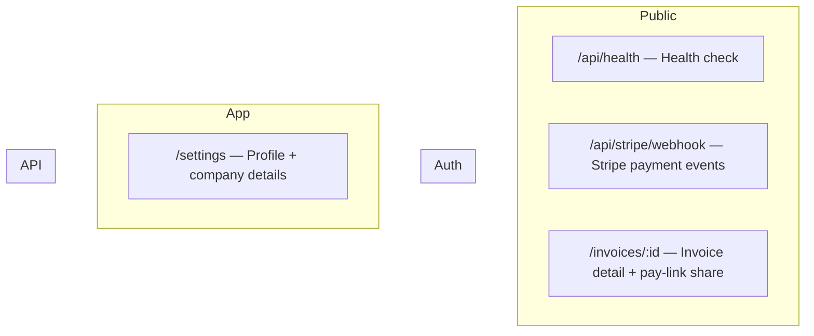

# Sitemap & App Map — InvoiceFlow

> Assembled by `pack-builder.mjs` from `pack-plan.json` · 2026-08-20. **The single source of truth for the whole app** — every route, page, endpoint and workflow. If it's not here, it's not in the MVP.

## 1. Full sitemap (every route in the app)

### 1.1 Visual sitemap (Mermaid — renders on GitHub)



### 1.2 Complete route table (every row IS the app)

| Route               | Page / purpose                                       | Group  | Auth      | Status |
| ------------------- | ---------------------------------------------------- | ------ | --------- | ------ |
| /                   | Landing — hook, features, pricing preview, CTA       | Public | none      | 🆕     |
| /pricing            | Pricing plans + FAQ                                  | Public | none      | 🆕     |
| /login              | Sign in — email                                      | Auth   | guest     | 🆕     |
| /signup             | Create account                                       | Auth   | guest     | 🆕     |
| /dashboard          | App home — invoice list, status stats, quick actions | App    | required  | 🆕     |
| /invoices/new       | Create invoice form                                  | App    | required  | 🆕     |
| /invoices/:id       | Invoice detail + pay-link share                      | App    | required  | 🆕     |
| /settings           | Profile + company details                            | App    | required  | 🆕     |
| /p/:token           | Public client pay page (no login)                    | Public | none      | 🆕     |
| /api/health         | Health check                                         | API    | none      | 🆕     |
| /api/stripe/webhook | Stripe payment events                                | API    | signature | 🆕     |

> Rule: the final app MUST contain exactly these routes — nothing more (scope creep), nothing less (missing screens).

---

## 2. Frontend pages — what each page needs

Page map → components uses the locked design system (`design-system.md`) component inventory.

### Landing — `/`

| Aspect                  | Value                                                                                 |
| ----------------------- | ------------------------------------------------------------------------------------- |
| **Purpose**             | Hook-first pitch: get paid in 48h, not 6 weeks                                        |
| **Layout**              | marketing shell — navbar, hero, feature cards, pricing preview, FAQ accordion, footer |
| **Auth level**          | public                                                                                |
| **Key components**      | navbar, hero, card, pricing table, accordion, footer                                  |
| **Data it reads**       | static                                                                                |
| **Actions it triggers** | CTA → /signup                                                                         |
| **States to build**     | none (static)                                                                         |
| **Navigation**          | → /signup, /pricing                                                                   |

### Pricing — `/pricing`

| Aspect                  | Value                               |
| ----------------------- | ----------------------------------- |
| **Purpose**             | Free vs Pro plan, one CTA           |
| **Layout**              | marketing shell                     |
| **Auth level**          | public                              |
| **Key components**      | pricing table, badge, FAQ accordion |
| **Data it reads**       | static                              |
| **Actions it triggers** | CTA → /signup                       |
| **States to build**     | none                                |
| **Navigation**          | → /signup                           |

### Sign in — `/login`

| Aspect                  | Value                                 |
| ----------------------- | ------------------------------------- |
| **Purpose**             | Email login                           |
| **Layout**              | centered auth card max-w-md           |
| **Auth level**          | guest                                 |
| **Key components**      | card, input, label, button, separator |
| **Data it reads**       | session                               |
| **Actions it triggers** | signIn credentials                    |
| **States to build**     | loading, error alert                  |
| **Navigation**          | → /dashboard                          |

### Sign up — `/signup`

| Aspect                  | Value                       |
| ----------------------- | --------------------------- |
| **Purpose**             | Create account              |
| **Layout**              | centered auth card max-w-md |
| **Auth level**          | guest                       |
| **Key components**      | card, input, label, button  |
| **Data it reads**       | session                     |
| **Actions it triggers** | createUser + signIn         |
| **States to build**     | loading, error alert        |
| **Navigation**          | → /dashboard                |

### Dashboard — `/dashboard`

| Aspect                  | Value                                                             |
| ----------------------- | ----------------------------------------------------------------- |
| **Purpose**             | Invoice list + paid/draft/unpaid stats + quick actions            |
| **Layout**              | app shell — sidebar, header, content                              |
| **Auth level**          | logged-in                                                         |
| **Key components**      | sidebar, stat cards, data table, badge, dialog, sonner, button    |
| **Data it reads**       | listInvoices (server component, ownership-filtered)               |
| **Actions it triggers** | createInvoice, sendInvoice                                        |
| **States to build**     | loading skeleton, empty state (create first invoice), error alert |
| **Navigation**          | → /invoices/new, /invoices/:id, /settings                         |

### New invoice — `/invoices/new`

| Aspect                  | Value                                                 |
| ----------------------- | ----------------------------------------------------- |
| **Purpose**             | Create + optionally send an invoice                   |
| **Layout**              | app shell — centered form                             |
| **Auth level**          | logged-in                                             |
| **Key components**      | form, input, textarea, currency input, button, sonner |
| **Data it reads**       | none (write only)                                     |
| **Actions it triggers** | createInvoice (zod) → revalidatePath('/dashboard')    |
| **States to build**     | validation errors, saving state                       |
| **Navigation**          | → /dashboard                                          |

### Invoice detail — `/invoices/:id`

| Aspect                  | Value                                           |
| ----------------------- | ----------------------------------------------- |
| **Purpose**             | View invoice, copy pay link, see payment status |
| **Layout**              | app shell                                       |
| **Auth level**          | owner-only                                      |
| **Key components**      | card, badge, button (copy link), timeline       |
| **Data it reads**       | getInvoice (ownership check)                    |
| **Actions it triggers** | sendInvoice, copyLink                           |
| **States to build**     | loading, not-found, error                       |
| **Navigation**          | → /dashboard                                    |

### Settings — `/settings`

| Aspect                  | Value                        |
| ----------------------- | ---------------------------- |
| **Purpose**             | Profile, company name, email |
| **Layout**              | app shell                    |
| **Auth level**          | logged-in                    |
| **Key components**      | form, input, button, sonner  |
| **Data it reads**       | getUser                      |
| **Actions it triggers** | updateProfile (zod)          |
| **States to build**     | saving state                 |
| **Navigation**          | → /dashboard                 |

### Client pay page — `/p/:token`

| Aspect                  | Value                                                  |
| ----------------------- | ------------------------------------------------------ |
| **Purpose**             | Public invoice + pay button — no login                 |
| **Layout**              | public minimal centered card                           |
| **Auth level**          | public (token)                                         |
| **Key components**      | card, invoice lines, button (Stripe Checkout redirect) |
| **Data it reads**       | getInvoiceByToken                                      |
| **Actions it triggers** | stripe checkout.session.create                         |
| **States to build**     | loading, invalid-token state                           |
| **Navigation**          | → Stripe hosted checkout                               |

### Health check — `/api/health`

| Aspect                  | Value              |
| ----------------------- | ------------------ |
| **Purpose**             | Liveness probe     |
| **Layout**              | —                  |
| **Auth level**          | none               |
| **Key components**      | —                  |
| **Data it reads**       | —                  |
| **Actions it triggers** | GET → { ok: true } |
| **States to build**     | —                  |
| **Navigation**          | —                  |

### Stripe webhook — `/api/stripe/webhook`

| Aspect                  | Value                                              |
| ----------------------- | -------------------------------------------------- |
| **Purpose**             | checkout.session.completed → mark paid             |
| **Layout**              | —                                                  |
| **Auth level**          | signature                                          |
| **Key components**      | —                                                  |
| **Data it reads**       | —                                                  |
| **Actions it triggers** | verify signature → update invoice + insert payment |
| **States to build**     | —                                                  |
| **Navigation**          | —                                                  |

---

## 3. Backend architecture (this app's, not generic)

### 3.1 Folder structure (target — Next.js App Router)

```
src/
├── app/                    # routes exactly as sitemap §1.2
│   ├── (marketing)/          # landing, pricing
│   ├── (auth)/login|signup/
│   ├── (app)/dashboard|invoices|settings/   # guarded layout group
│   ├── p/[token]/            # public pay page
│   ├── api/health/route.ts
│   ├── api/stripe/webhook/route.ts
│   └── layout.tsx            # fonts, theme provider, Toaster
├── components/               # ui/ (shadcn) + feature components
├── lib/                      # db.ts (drizzle), auth.ts, stripe.ts, utils.ts
├── db/                       # schema.ts, migrations/
├── actions/                  # createInvoice, sendInvoice, updateProfile
└── middleware.ts             # auth guard + rate limit
```

### 3.2 Data model (paste-ready — matches PRD §6)

```sql
users        (id uuid pk, email text unique, password_hash text, name text, created_at)
subscriptions(id uuid pk, user_id fk, stripe_customer_id, stripe_sub_id, status enum, current_period_end, created_at)
invoices     (id uuid pk, user_id fk, client_email, client_name, amount_cents, currency, status enum, stripe_session_id, created_at)
payments     (id uuid pk, invoice_id fk, provider_ref, amount_cents, created_at)
```

Rules: `user_id` FK on every owned table · `created_at` default now() · indexes on `user_id`, `status`, `email` · every user-scoped query filters by `eq(x.userId, session.user.id)`.

### 3.3 Backend endpoints & server actions (every one the frontend calls)

| Method | Path / action       | Purpose                                | Auth       | Input (zod)                                      |
| ------ | ------------------- | -------------------------------------- | ---------- | ------------------------------------------------ |
| action | createInvoice       | Create invoice from /invoices/new      | session    | {clientEmail, clientName, amountCents, currency} |
| action | sendInvoice         | Mark sent + create pay token           | session    | {invoiceId}                                      |
| action | updateProfile       | Update name/company                    | session    | {name, companyName}                              |
| GET    | /api/health         | Health check                           | none       | —                                                |
| POST   | /api/stripe/webhook | checkout.session.completed → mark paid | Stripe sig | Stripe event                                     |

### 3.4 Auth flow (this app)

1. email + password via lib/auth.ts (Auth.js v5 credentials provider)
2. middleware.ts guards /dashboard/:path*, /invoices/:path*, /settings/:path*, /api/:path* → redirect /login
3. server reads auth(); client reads useSession(); loading state while hydrating
4. ownership: every query filters by session user.id — never trust the client

### 3.5 Payments flow (monetized)

1. /dashboard sendInvoice → creates Stripe Checkout Session (mode: payment) with metadata { userId, invoiceId }
2. webhook api/stripe/webhook verifies with STRIPE_WEBHOOK_SECRET → checkout.session.completed → set invoices.status = paid + insert payments
3. /invoices/:id and /dashboard reflect paid
4. local test: stripe listen --forward-to localhost:3000/api/stripe/webhook

### 3.6 Env vars (paste into `.env.example`)

| Var                     | Example                 | Where it comes from                       |
| ----------------------- | ----------------------- | ----------------------------------------- |
| DATABASE_URL            | postgres://…            | Neon                                      |
| AUTH_SECRET             | openssl rand -base64 32 | Auth.js                                   |
| STRIPE_SECRET_KEY       | sk_test_…               | Stripe (test mode)                        |
| STRIPE_WEBHOOK_SECRET   | whsec_…                 | Stripe dashboard → webhooks               |
| NEXT_PUBLIC_APP_URL     | http://localhost:3000   | you (production: https://invoiceflow.app) |
| NEXT_PUBLIC_POSTHOG_KEY | phc_…                   | PostHog                                   |
| OPENAI_API_KEY          | sk-…                    | OpenAI (AI reminder feature, server-only) |

---

## 4. Workflows — how users and the system move through the app

### 4.1 Core user journeys (step-by-step)

**Journey 1 — Get paid on an invoice**

1. User signs up → lands on /dashboard (empty state: 'Create your first invoice')
2. Clicks New invoice → /invoices/new → fills form → submit createInvoice
3. List at /dashboard shows the invoice as draft; user clicks Send → pay link generated
4. Client opens /p/:token → sees invoice → pays with card on Stripe
5. Webhook marks invoice paid → /invoices/:id shows paid + confirmation
6. User sees payment reflected in /dashboard stats

**Journey 2 — Free → Pro upgrade**

1. /dashboard shows a Free plan badge once 3 invoices are used
2. CTA to /pricing → Stripe Checkout (subscription) → back with status active
3. Invoice cap lifts; reminder emails unlock

### 4.2 System workflows (backend, step-by-step)

**Auth (signup → session)**

1. POST /signup (server action) → zod validate → bcrypt hash → insert users → create session → redirect /dashboard

**Invoice payment (one-time)**

1. sendInvoice action → creates a Checkout Session for amount_cents + stores stripe_session_id + pay token
2. checkout.session.completed webhook → verify signature → match invoiceId via metadata → set invoices.status = paid + insert payments
3. /invoices/:id + /dashboard reflect paid

---

## 5. Definition of done (this file is complete when…)

- [ ] §1.2 route table has every route, no placeholders left
- [ ] §2 has one filled page block per route in §1.2
- [ ] §3 backend matches `PRD.md` §6 data model and `stack-blueprint.md` §4–5
- [ ] §4 covers every PRD must-have flow as a numbered journey/system workflow
- [ ] No route, page, table, endpoint, or step appears in the build order (`stack-blueprint.md` §6 / `TODO.md`) that is missing here
