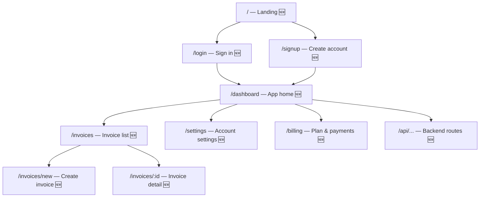
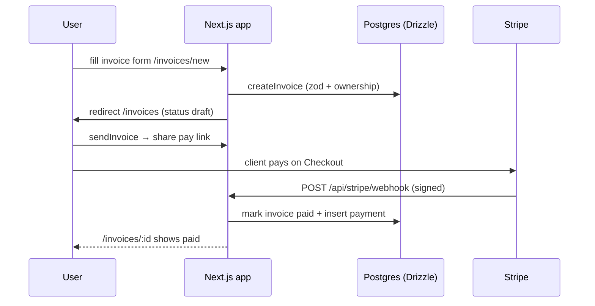

# Sitemap & App Map — {App Name}

> Copy this template to `sitemap.md` (project root) at Stage 3, alongside `PRD.md`
> and `stack-blueprint.md`. It is the **single source of truth for the whole app**:
> (1) the full **sitemap** (every route), (2) every **frontend page** you need,
> (3) the **backend architecture**, and (4) the **workflows** that connect them.
> The vibe coder (or Lovable/Bolt/v0 handoff prompt) builds FROM this file — so
> if a page, route, table, or step is not here, it is not in the MVP.
>
> **How to fill it:** derive from the PRD must-haves + the analysis. Every page in
> §2 must appear in the §1 sitemap; every workflow in §4 must only use pages and
> backend pieces from §1–§3. Leave nothing generic — fill every `{bracket}`.
>
> **Existing-project mode:** start from `project-scan.md` — mark existing routes
> with ✅ (keep), extend them with ➕ (change), and list new ones with 🆕 (add).

---

## 1. Full sitemap (every route in the app)

### 1.1 Visual sitemap (Mermaid — renders on GitHub)



### 1.2 Complete route table (fill every row — this IS the sitemap)

| Route | Page / purpose | Group | Auth | Status |
|---|---|---|---|---|
| `/` | {Landing — hook, features, pricing preview, CTA} | Public | none | 🆕 |
| `/pricing` | {Pricing plans + FAQ} | Public | none | 🆕 |
| `/login` | {Sign in — email/Google} | Auth | guest | 🆕 |
| `/signup` | {Create account} | Auth | guest | 🆕 |
| `/forgot-password` | {Reset flow} | Auth | guest | 🆕 |
| `/dashboard` | {App home — stats, quick actions} | App | required | 🆕 |
| `/invoices` | {List, filter, search} | App | required | 🆕 |
| `/invoices/new` | {Create/edit invoice form} | App | required | 🆕 |
| `/invoices/:id` | {Detail + share/pay link} | App | required | 🆕 |
| `/settings` | {Profile, workspace, preferences} | App | required | 🆕 |
| `/billing` | {Current plan, upgrade, invoices} | App | required | 🆕 |
| `/api/health` | {Health check} | API | none | 🆕 |
| `/api/stripe/webhook` | {Payment events} | API | signature | 🆕 |
| {…add all other routes…} | | | | |

> Rule: the final app MUST contain exactly these routes — nothing more (scope
> creep), nothing less (missing screens). Every `{…}` placeholder is resolved at
> Stage 3; unresolved ones are an open question, not a silent decision.

---

## 2. Frontend pages — what each page needs

For every page in §1.2, fill one block. **Page map → components** uses the
locked design system (`design-system.md`) component inventory.

### {Page name} — `{route}`

| Aspect | Value |
|---|---|
| **Purpose** | {one line — what the user achieves here} |
| **Layout** | {marketing shell / centered auth card `max-w-md` / app shell with sidebar} |
| **Auth level** | {public / guest-only / logged-in / owner-only} |
| **Key components** | {shadcn: navbar, hero, card, table, badge, dialog, sonner…} |
| **Data it reads** | {e.g. `GET invoices` via server component; `useSession()`} |
| **Actions it triggers** | {e.g. server action `createInvoice(zod)` → `revalidatePath("/invoices")`} |
| **States to build** | {loading skeleton · empty state · error alert · offline?} |
| **Navigation** | {where the user lands from / goes to} |

*(Duplicate this block for every page — landing, pricing, login, signup,
dashboard, invoices list, invoice new, invoice detail, settings, billing,
… — until §1.2 is fully covered.)*

### Page → component map (quick reference)

| Page/Route | Components (shadcn) | Notes |
|---|---|---|
| `/` landing | navbar, hero, feature cards, pricing table, FAQ accordion, footer | hook-first hero, one CTA |
| `/login` `/signup` | card, input, label, OAuth buttons, separator | `max-w-md`, centered |
| `/dashboard` | sidebar/sheet, stat cards, data table, badge, tabs, dialog, sonner | app shell layout group |
| … | … | … |

---

## 3. Backend architecture (this app's, not generic)

Derived from `backend-architecture.md` defaults — only what THIS app uses.

### 3.1 Folder structure (target — Next.js App Router)

```
src/
├── app/                    # routes exactly as §1.2
│   ├── (marketing)/        # landing, pricing
│   ├── (auth)/login|signup|forgot-password/
│   ├── (app)/dashboard|invoices|settings|billing/   # guarded layout group
│   ├── api/stripe/webhook/route.ts
│   └── layout.tsx          # fonts, theme provider, Toaster
├── components/             # ui/ (shadcn) + feature components
├── lib/                    # db.ts (drizzle), auth.ts, stripe.ts, utils.ts
├── db/                     # schema.ts, migrations/
├── actions/                # server actions per feature (zod-validated)
└── middleware.ts           # auth guard + rate limit
```

### 3.2 Data model (paste-ready — matches PRD §6)

```sql
-- drizzle schema (db/schema.ts) — generated via drizzle-kit
users        (id uuid pk, email text unique, password_hash text, name text, created_at)
subscriptions(id uuid pk, user_id fk, stripe_customer_id, stripe_sub_id, status enum,
              current_period_end, created_at)
invoices     (id uuid pk, user_id fk, client_email, amount_cents, currency, status enum,
              stripe_session_id, created_at)
payments     (id uuid pk, invoice_id fk, provider_ref, amount_cents, created_at)
```

Rules: `user_id` FK on every owned table · `created_at` default now() · indexes on
`user_id`, `status`, `email` · every user-scoped query filters by
`eq(x.userId, session.user.id)`.

### 3.3 Backend endpoints & server actions (every one the frontend calls)

| Method | Path / action | Purpose | Auth | Input (zod) |
|---|---|---|---|---|
| action | `createInvoice` | {create invoice from /invoices/new} | session | {clientEmail, amountCents…} |
| action | `sendInvoice` | {mark sent + share link} | session | {invoiceId} |
| POST | `/api/stripe/webhook` | {checkout.session.completed → mark paid} | Stripe sig | — |
| GET | `/api/health` | {health check} | none | — |
| … | … | … | … | … |

### 3.4 Auth flow (this app)

1. {email+password and/or Google} via `lib/auth.ts` (Auth.js v5 or Supabase Auth).
2. `middleware.ts` guards `/dashboard/:path*`, `/invoices/:path*`, `/settings/:path*`, `/billing/:path*`, `/api/:path*` → redirect to `/login`.
3. Server reads `auth()`; client reads `useSession()`; loading state while hydrating.
4. Ownership: every query filters by session `user.id` — never trust the client.

### 3.5 Payments flow (only if monetized)

1. `/billing` → server action creates Stripe **Checkout Session** (`mode: subscription|payment`, `metadata: { userId }`).
2. Webhook `api/stripe/webhook` verifies with `STRIPE_WEBHOOK_SECRET`, switches on `checkout.session.completed` / `customer.subscription.updated` / `invoice.payment_failed` → updates `subscriptions.status`.
3. Entitlement gate: `currentPlan()` read server-side; premium routes/actions check it.
4. Local test: `stripe listen --forward-to localhost:3000/api/stripe/webhook`.

### 3.6 Env vars (paste into `.env.example`)

| Var | Example | Where it comes from |
|---|---|---|
| `DATABASE_URL` | `postgres://…` | Neon / Supabase |
| `AUTH_SECRET` | `openssl rand -base64 32` | Auth.js |
| `AUTH_GOOGLE_ID` · `AUTH_GOOGLE_SECRET` | … | Google Cloud OAuth |
| `STRIPE_SECRET_KEY` · `STRIPE_WEBHOOK_SECRET` | `sk_test_…` · `whsec_…` | Stripe (test mode) |
| `NEXT_PUBLIC_APP_URL` | `http://localhost:3000` | you |

---

## 4. Workflows — how users and the system move through the app

### 4.1 Core user journeys (step-by-step)

**Journey 1 — {e.g. Get paid on an invoice}**
1. User signs up → lands on `/dashboard` (empty state: "Create your first invoice").
2. Clicks "New invoice" → `/invoices/new` → fills form → submit `createInvoice`.
3. List at `/invoices` shows the invoice with status `draft`; user sends it → client gets pay link.
4. Client pays → webhook updates status → `/invoices/:id` shows `paid` + confirmation.
5. User sees the payment reflected in `/dashboard` stats.

**Journey 2 — {e.g. Upgrade to a paid plan}** *(if monetized)*
1. `/dashboard` shows a "Free plan" badge → CTA to `/billing`.
2. User picks a plan → Checkout Session → Stripe hosted page → success → back to `/billing` with status `active`.
3. Premium feature unlocks; downgrade/cancel path in `/billing`.

*(Add every PRD must-have flow as a journey.)*

### 4.2 System workflows (backend, step-by-step)

**Auth (signup → session)**
1. `POST /signup` (server action) → zod validate → bcrypt hash → insert `users` → create session → redirect `/dashboard`.

**Checkout → entitlement (subscription)**
1. `/billing` action → `stripe.checkout.sessions.create({mode:"subscription", metadata:{userId}})` → redirect to `url`.
2. `checkout.session.completed` webhook → verify signature → upsert `subscriptions` (status `active`) → 200.
3. `currentPlan()` now returns `active` → premium UI unlocks on next render.

**Invoice payment (one-time)**
1. `sendInvoice` action → creates a Checkout Session for `amount_cents` + stores `stripe_session_id`.
2. `checkout.session.completed` webhook → match `invoice_id` via metadata → set `invoices.status = paid` + insert `payments`.
3. `/invoices/:id` + `/dashboard` reflect `paid`.

### 4.3 End-to-end diagram (Mermaid sequence — optional but recommended)



---

## 5. Definition of done (this file is complete when…)

- [ ] §1.2 route table has every route, no `{…}` placeholders left
- [ ] §2 has one filled page block per route in §1.2 (no page in the sitemap without a block)
- [ ] §3 backend matches `PRD.md` §6 data model and `stack-blueprint.md` §4–5
- [ ] §4 covers every PRD must-have flow as a numbered journey/system workflow
- [ ] No route, page, table, endpoint, or step appears in the build order (`stack-blueprint.md` §6 / `TODO.md`) that is missing here
- [ ] Existing-project mode: ✅/➕/🆕 markers match `project-scan.md`
