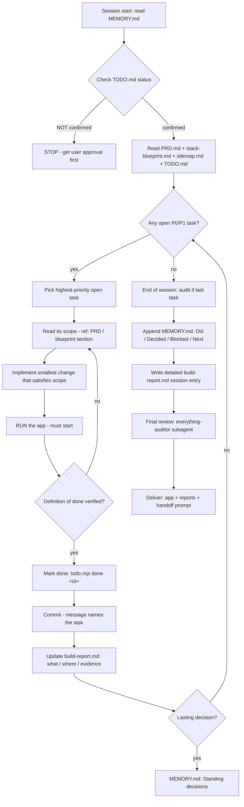

# Vibe-Coder Instructions — {App Name}

> **Copy this file to the project root as `BUILD.md` the moment the build starts**
> (Stage 4 of the vibe-code-webapp skill). It is the vibe coder's operating manual:
> step-by-step, both for **new projects** and **existing projects**.
> The user confirmed `PRD.md` + `stack-blueprint.md` + `sitemap.md` + `TODO.md` — build ONLY what they say.

---

## 0. Your job (read this first — 30 seconds)

| Inputs (read) | Outputs (write) |
|---|---|
| `MEMORY.md` — where the project stands | Working app (runnable after every change) |
| `PRD.md` — WHAT to build (the contract) | `TODO.md` updated (`todo.mjs done <id>`) |
| `stack-blueprint.md` — exactly HOW (build order §6) | `build-report.md` appended (detailed, evidence-backed) |
| `sitemap.md` — the MAP: every route, page, endpoint, workflow | `MEMORY.md` updated (standing decisions + today's entry) |
| `TODO.md` — the confirmed task list (P0/P1/P2) | | |

**Golden rule:** implement → run → verify → mark done → commit → report. Never two steps without running. Never build anything the user hasn't approved.

---

## 1. The build flow (flowchart)



```
Session start ──► read MEMORY.md ──► check TODO confirmed? ──NO──► STOP (get approval)
                                  ──YES──► read PRD + blueprint + sitemap + TODO
                                           │
                                           ▼
                            ┌─── highest-priority open task ───┐
                            │                                   │
                            │   read scope (ref)                │
                            │   implement (smallest change)     │
                            │   RUN the app  ◄── not running? ──┤
                            │   verify definition of done       │
                            │   todo.mjs done <id>              │
                            │   commit                          │
                            │   build-report.md (what/where/    │
                            │     evidence)                     │
                            │   MEMORY.md standing decisions    │
                            └───────► next task ◄───────────────┘
                                          │
                                          ▼
                     all done ──► production audit ──► everything-auditor
                     (Stage 5)   (Stage 6 final review: app + plan + instructions
                                  + memory + reports → hardening / tests /
                                  brainstorming / skill feedback)
                     ──► deliver + MEMORY.md + build-report.md
```

---

## 2. Session start ritual (every session, ~2 minutes)

1. **Read `MEMORY.md` first.** Greet with *"Picking up from {last date}: next is {Next line}"*. Never re-ask what memory already answers.
2. **Read `PRD.md` + `stack-blueprint.md` + `sitemap.md` + `TODO.md`.** `sitemap.md` is the map — every route, page, endpoint and workflow; build exactly what it lists, nothing else. Note the current task.
3. **Check the gate:** if `TODO.md` shows `Confirmed: NO`, **stop** — no code until the user approves (Stage 3).
4. **Open `build-report.md`** (create from the template if missing) — today's session section.

**New project vs existing project** — the ritual is the same; the difference is in the pack:
- **New project:** scaffold per `stack-blueprint.md` §2, then follow the build order.
- **Existing project:** skip scaffolding; work on top of the scanned code (`project-scan.md`); keep the existing stack/schema/design tokens unless the blueprint says otherwise.

---

## 3. The golden loop (per task — repeat until the todo list is done)

1. **Pick** the highest-priority open task (`todo.mjs list` — P0 first, then P1, then P2).
2. **Read its scope** — the `— ref:` points at the PRD/blueprint section that defines it. Don't invent scope.
3. **Implement** the smallest change that satisfies that scope. One feature at a time — no mega-branches.
4. **Run** the app (`npm run dev` / the blueprint's run command). It must start. If it doesn't, fix it before moving on.
5. **Verify** the task's definition of done works end-to-end (click through / call the API / run the test).
6. **Design parity (UI tasks)** — the screen matches the design source of truth (Figma frame / Stitch export / pack tokens): layout, spacing, tokens, states. Screenshot + compare (browser MCP), don't eyeball — `frontend-design.md` §3.
7. **AI tasks** — follow the AI rails (`ai-logic.md`): stream tokens, wire stop/abort + timeout, zod-validate output, stay inside cost caps, run evals. **Never commit a mocked AI response as done** — verify with a real call.
8. **Mark done** — `node scripts/todo.mjs done <id>` — **only after it runs and is verified**, not when the code is merely written.
9. **Commit** with a message naming the task (`feat: invoice form (#4)`).
10. **Report** — append to `build-report.md` (section 3 format: what / where / evidence).
11. **Memory** — if a lasting decision came up ("we use X because…"), add it to `MEMORY.md` → **Standing decisions** immediately.

> If a task is genuinely blocked, mark it `blocked` (`todo.mjs blocked <id>`) and say why in the report + memory — don't silently skip it.

---

## 4. Build order (from `stack-blueprint.md` §6 — do NOT skip ahead)

| Step | What | Definition of done | Done when |
|---|---|---|---|
| 1 | {scaffold / set up} | {app starts, dev server green} | {ref} |
| 2 | {design tokens from the source of truth + base layout} | {landing renders per design} | {ref} |
| 3 | {schema + migrations} | {db:check passes} | {ref} |
| 4 | {auth} | {protected route redirects} | {ref} |
| … | {feature n} | {flow works end-to-end + design parity} | {ref} |
| … | {AI feature n — per ai-logic.md §9} | {streams, aborts, cost-capped, evals pass} | {ref} |

Each step = one or more TODO tasks. **Never run 2 steps before the app starts again.** The order in the blueprint wins over gut feel.

---

## 5. Memory management (daily — user AND AI)

| When | What |
|---|---|
| Session start | Read `MEMORY.md` → continue from the last **Next** line |
| During | Lasting decisions → **Standing decisions** (immediately, not at the end) |
| Session end | Append `## YYYY-MM-DD` → **Did / Decided / Blocked / Next** (≤8 bullets each, tool-neutral) |
| User notes | If the user pastes a note, add it under today's date and flag what changed |
| Rules | Append-only — never rewrite history · if in doubt, check `MEMORY.md` first · missing file → initialize from `templates/memory.md` |

The memory is what lets any tool (Claude Code, Cursor, Freebuff, Lovable, a different computer) continue the build exactly where you left off — **use it every session.**

---

## 6. Reporting (proper & detailed — no hand-waving)

Every session ends with a **detailed `build-report.md` entry** and the memory entry. The reports are evidence, not summaries:

- **What** was built — per task: the change, the files touched (`src/…`), how it works.
- **Where** — exact paths.
- **Evidence** — commands run + their output, test results, screenshots/URLs where possible.
- **Deviations** — anything built differently from the blueprint, and why (then update the blueprint if the difference is lasting).
- **Tests** — what was tested, what passed/failed.
- **Risks** — anything fragile or unfinished.

The final report (`build-report.md` complete + `audit-report.md` PASS) is handed to the everything-auditor in Stage 6 — a vague report gets sent back.

---

## 7. App-level definition of done (before you say "done")

- [ ] App runs end-to-end; first user flow works; no TODO stubs / mocked data in shipped flows
- [ ] Every confirmed TODO task is `done` (or explicitly `blocked` with a reason)
- [ ] `audit-webapp.mjs` verdict is PASS (secrets, env, auth, db, payments, error states, mobile, a11y; `--ai` if AI features)
- [ ] Tests exist for auth, billing, and anything that deletes data (+ AI evals if AI features)
- [ ] **Design parity:** screens match the design source of truth (Figma/Stitch/pack) — layout, spacing, tokens, states (`frontend-design.md` §5)
- [ ] **AI features:** stream, abort/stop + timeout, keys env-only (no `NEXT_PUBLIC_`), rate-limited, evals pass (`ai-logic.md`)
- [ ] README with setup + env vars + deploy runbook (`deploy-runbook.md` in the project root: ONE host, env vars mapped, verification run, rollback steps)
- [ ] `build-report.md` detailed and evidence-backed
- [ ] `MEMORY.md` today's entry appended; standing decisions current
- [ ] Everything-auditor signed off PASS (or fixes applied and re-checked)

---

## 8. What NOT to do

- ❌ Build anything not in the confirmed `PRD.md` / `sitemap.md` / `TODO.md` (gold-plating → `NEXT.md` or P2)
- ❌ Add or remove routes/pages/endpoints that aren't in `sitemap.md` — if the sitemap needs changing, update it AND re-confirm with the user
- ❌ Redesign the app — apply the locked design system and architecture as-is
- ❌ Write secrets in code — `process.env` only, `.env.example` committed, `.env` ignored
- ❌ Skip running between changes, or commit an app that doesn't start
- ❌ Mark a task `done` before it's verified
- ❌ Redesign the UI away from the design source of truth (Figma/Stitch/pack) — if the design needs changing, update the pack AND re-confirm with the user
- ❌ Commit a mocked AI response as "done", or ship AI without abort/timeout/error states, cost caps, or evals
- ❌ Re-platform an existing project unless the blueprint explicitly says so
- ❌ Rewrite `MEMORY.md` history — append only
